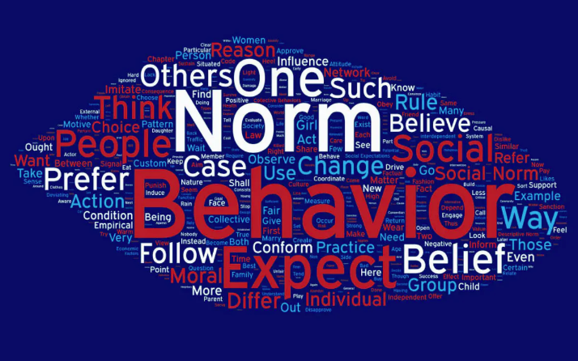

<style>
h2 { 
 color: #3399ff;		
}
h3 { 
 color: #3399ff;		
}
</style>

```{r setup, include=FALSE}
knitr::opts_chunk$set(echo = F)
```

## About 
- [Center for Social Norms and Behavioral Dynamics](https://normsandbehavior.sas.upenn.edu/)
{width=650px}

## Project in India with Gates Foundation
{width=650px}

## Overview

1. Pre-processing

2. Descriptive statistics 

3. Analysis results

4. Visualization 

## Pre-processing 
```{r, include=T, error=F, message=F, echo = T}
library(tidyverse)
```
{width=800px}

## Label support
```{r, include=T, error=F, message=F, echo = T}
library(expss)
data <- expss::read_spss("data.sav")
```

## Label support
```{r, echo = T}
expss::var_lab(data$Q1vii)
```

```{r, echo=T}
expss::val_lab(data$Q1vii)
```


## Descriptive statistics  
```{r, include=T, error=F, message=F, echo = T}
library(expss)
library(openxlsx)
```

## Descriptive statistics 

```{r, echo = T, eval=F }
# create a table
table <- data %>% 
         tab_cells(gender, education, SES ) %>%
         tab_cols(total(), state) %>% 
         tab_stat_cpct() %>%
         tab_pivot() %>%
         set_caption("Table 1. demographic by state ")

# create a workbook
workbook = createWorkbook()

#create a sheet in the workbook
sheet = addWorksheet(workbook, "Table 1")

# write the table into the sheet 
xl_write(table, workbook, sheet)

# save workbook
saveWorkbook(workbook, "output/desc-stat.xlsx", overwrite = TRUE)
```

## Analaysis results
```{r, include=T, error=F, message=F, echo = T}
library(stargazer)
```

## Analaysis results 
{width=600px}

## Visualization
```{r, include=T, error=F, message=F, echo = T}
library(ggplot2)
library(ggmap)    
```

## Visualization
```{r, include=T, error=F, message=F, echo = T}
library(ggthemes)  # extra geoms, scales, and themes for ggplot 
library(plotly)    # create interactive ggplot2 graphs
```

{width=600px}

- There is also a great [cheat sheet](https://images.plot.ly/plotly-documentation/images/r_cheat_sheet.pdf?_ga=2.144655730.634097270.1588348056-452179466.1588348056) for plotly.

## Summary 

```{r, include=T, error=F, message=F, echo = T}
# pre-processing
library(tidyverse)

# Descriptive statistics
library(expss)
library(openxlsx)

# Analysis results
library(stargazer)

# Visualization
library(ggthemes)
library(plotly)
```


## Stay connected 

- Website:    www.jinyikuang.com
- Email:      jkuang000@gmail.com
- Twitter:    @jinyikuang
- Github:     jinyikuang000


